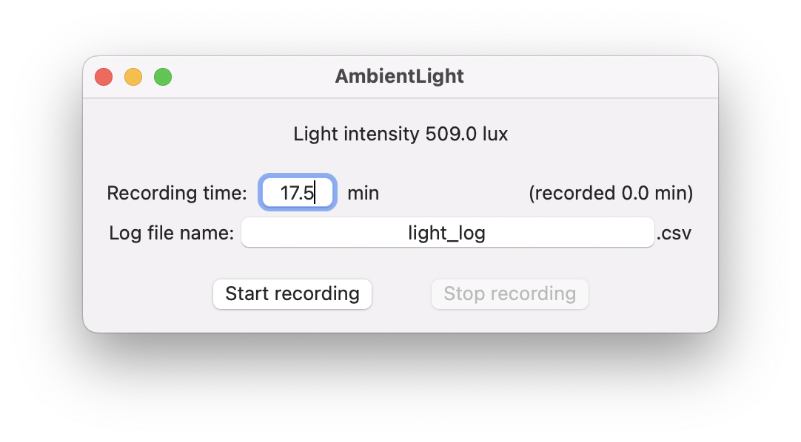

# AmbientLight | Acquiring raw ambient light sensor data from macOS

by [Yang Liu, MIT CSAIL](https://liuyang12.github.io/)

Notes from the developer:

- Private API of accessing ambient light sensors on macOS hiden by Apple T1/T2 security chips is borrowed and appreciated from [DarkModeBuddy](https://github.com/insidegui/DarkModeBuddy) by [Guilherme Rambo](https://github.com/insidegui).

- As noted in [DarkModeBuddy](https://github.com/insidegui/DarkModeBuddy), the API requires macOS Catalina or later and a Mac with a built-in ambient light sensor (i.e., iMacs/iMac Pros later 2012 and newer,  MacBook Air/Pro mid 2012 and newer, including recent ones with M1/M1 Pro/Max chips). External displays with ambient light sensors (e.g., Apple Pro XDR displays/Studio Displays, LG UltraFine 4K/5K displays) are not currently supported.

- Test platform: MacBook Pro 13-inch 2019 (Intel, four-thunderbolt) running macOS Monterey 12.3.1 and Xcode 13.3.1.

- This repository will be left as it is now and is not subject to update upon any request.

## Usage

1. [download](https://github.com/liuyang12/AmbientLight/archive/refs/heads/main.zip) or [`ssh clone`](https://github.com/liuyang12/AmbientLight.git) the repository from github.
2. unzip and open `AmbientLight.xcodeproj` using Xcode.
3. build and run the project. 
4. start and stop recording ambient light sensor data given recording time and filename for saving as shown in the screenshot above.
   
   
